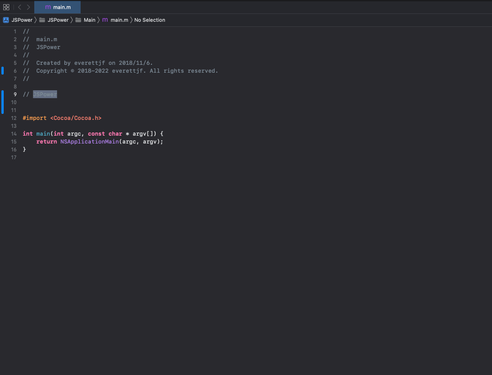
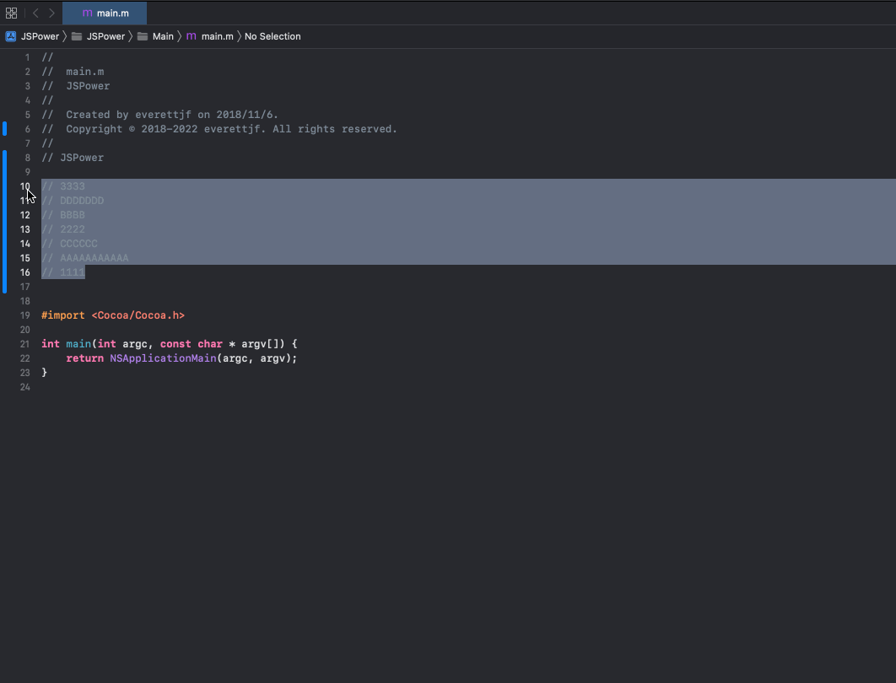
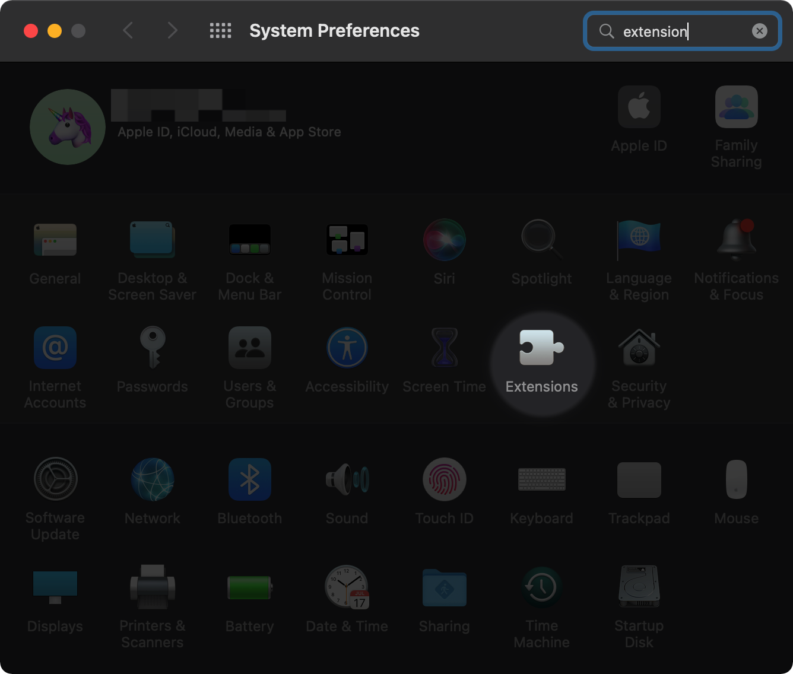
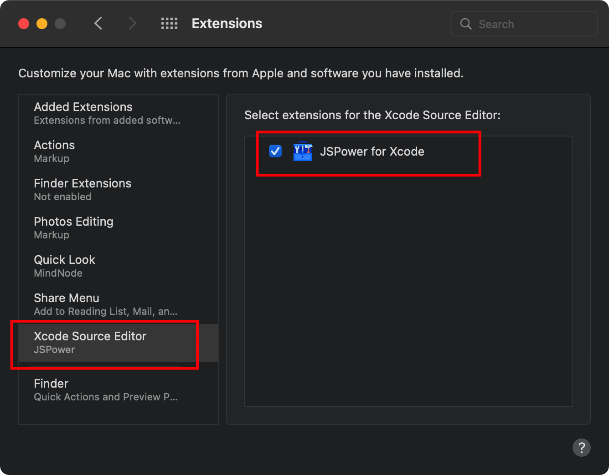

[JSPower](https://jspowerx.github.io/) / [Marketplace](https://jspowerx.github.io/marketplace) / [Develop](https://jspowerx.github.io/develop) / [About Me](https://github.com/everettjf)

## JSPower

JSPower is an Xcode extension, it provide development interface for the JavaScript language. Anyone can create Xcode extension utilities using JavaScript.

Install from [Mac App Store](https://itunes.apple.com/app/code-friend/id1441249580) and see `How to enable in Xcode` section below.

For developing an Xcode extension using JavaScript, please see [How To Create Your Own Package](https://jspowerx.github.io/develop).

---

### Builtin utilities

For the builtin utilities, you could:
1) Convert selected text into ASCII Text.

2) Sort selected lines.

### DLC Pack 1

After install the DLC Pack 1 from JSPower macOS app, you could :

3) Comment code block.

4) Jump to up/down 20 line.

### More you can do

Of course, more you can do if you create your own package using JavaScript language.

See [How To Create Your Own Package](https://jspowerx.github.io/develop).

### Marketplace

See [JSPower Marketplace](https://jspowerx.github.io/marketplace/) for a list of packages shared by our JSPower in the world.

If you want to share your utilities with the world, create a pull request to [this file](https://github.com/jspowerx/jspowerx.github.io/blob/master/marketplace/README.md).

### How to enable in Xcode

System Preferences -> Extensions -> Xcode Source Editor -> JSPower Extension

## Feedback

Create Issues [Here](https://github.com/jspowerx/jspowerx.github.io/issues)

---

*Enjoy!*

